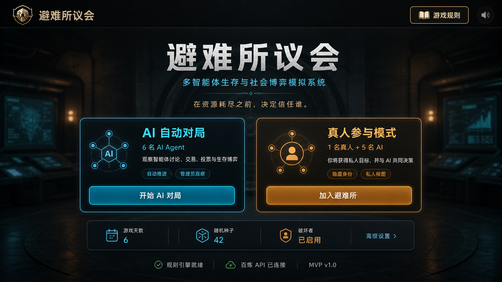

# 避难所议会（可展示 MVP）

《避难所议会：基于大语言模型的多智能体生存与社会博弈模拟系统》是一个回合制社会博弈项目。当前版本包含独立规则引擎、规则 Bot、百炼 LLM、权限隔离、日志回放，以及面向演示的 Streamlit 开始页和对局仪表盘。

## 已实现功能

- 默认 6 名玩家、5 名普通阵营、1 名隐藏破坏者、6 个游戏日；支持配置玩家数、0/1 名真人、天数、破坏者、随机种子、模型和最大步骤。
- 固定状态机：`EVENT → DISCUSSION → ACTION → VOTING → RESOLUTION → 可选 EXPULSION`。
- 五种公开职业、职业 AP 优惠和冷却技能；六种健康状态限制。
- 14 种基础动作及警卫保护；秘密破坏、偷窃和谣言的公开日志不会泄露执行者。
- 12 个不同难度、资源成本和后果的事件；设施耐久会影响消耗、探索、治疗风险和每日结算。
- 公共方案、严格过半投票、资源二次校验、交易/赠送/承诺、两人联合提名、秘密驱逐票。
- 私人目标、阵营胜负、个人结果、积分和基础赛后摘要。
- 玩家绑定的权限视图；LLM 只接收本人的公开/私人视图，不接收完整 `GameState`。
- 基于 JSON 的完整存档/恢复、公开回放和按天时间线。
- 无 API Key 时使用有限步骤的规则 Bot；模型调用或 JSON 校验失败时自动 fallback。
- Streamlit 开始页支持 AI 自动对局和真人参与两种模式。
- 游戏规则弹窗在开始页和进入对局后始终可访问。
- 对局页提供单步/自动推进、事件、资源、设施、议会、私人状态、日志和赛后复盘视图。

## 核心规则

- 健康玩家每天 2 AP，受伤玩家 1 AP；其他不能行动的状态由 Python 规则引擎拒绝。
- 投票不消耗 AP。公共方案与驱逐均须赞成数严格超过当前有效投票人数的一半，平票失败。
- 错误驱逐普通玩家会令 `stability -8`；真实身份只在整局结束后公开。
- 第 6 天结算后，稳定度、食物/能源、在场人数和核心设施共同决定避难所是否存活。
- 稳定度归零、食物或能源连续两天归零、在场人数过少或全部设施失效会立即崩溃。
- 所有数值、合法性、随机结果和秘密权限均由确定性 Python 代码控制，LLM 只选择结构化策略。

## 系统架构

```text
app.py / main.py
  ├─ agents/       规则 Bot、LLM Agent、真人后端门面、Pydantic schema、记忆
  ├─ game/         模型、状态机、动作规则、事件、投票、驱逐、计分、回放
  ├─ services/     百炼兼容 LLMClient、JSON 存档、分级日志导出
  ├─ ui/           开始页、规则弹窗、对局仪表盘、真人操作与主题
  ├─ config/       游戏参数和提示词
  ├─ data/         12 个事件、职业技能、私人目标
  └─ tests/        核心规则与完整流程测试
```

信息边界：

```text
GameState（系统）
  ├─ get_public_state()  → 公共资源、设施、公开玩家信息、方案
  ├─ PlayerView          → 绑定玩家本人的目标、阵营、线索、记忆
  └─ get_admin_state()   → 明确标记的调试观察视图，不传给 LLM
```

## 安装

推荐 Python 3.11 或更新版本，在项目目录执行：

```bash
python -m venv .venv
```

Windows PowerShell：

```powershell
.\.venv\Scripts\Activate.ps1
pip install -r requirements.txt
Copy-Item .env.example .env
```

macOS/Linux：

```bash
source .venv/bin/activate
pip install -r requirements.txt
cp .env.example .env
```

不要把真实 API Key 写入代码、README、日志或提交到 Git；`.env` 已被忽略。

## 环境变量

```dotenv
DASHSCOPE_API_KEY=
DASHSCOPE_BASE_URL=https://dashscope.aliyuncs.com/compatible-mode/v1
NORMAL_AGENT_MODEL=qwen3.6-flash
STRATEGY_AGENT_MODEL=qwen3.7-plus
REVIEW_MODEL=qwen3.7-plus
```

所有模型调用统一经过 `services/llm_client.py`。客户端启用超时、有限重试、Pydantic JSON 校验、一次格式修复和规则 Bot fallback。

## 启动与演示

启动图形界面：

```bash
python -m streamlit run app.py
```

浏览器打开 Streamlit 给出的本地地址。开始页可以选择 AI 自动对局或真人参与；右上角的“游戏规则”在进入对局后仍然保留。

命令行模式：

无 Key 的纯规则 Bot 自动对局：

```bash
python main.py
```

固定种子：

```bash
python main.py --seed 2026
```

配置好百炼环境变量后尝试多 LLM Agent；任一调用失败不会中断对局：

```bash
python main.py --llm
```

限制只有 1 名玩家使用 LLM，其余玩家使用规则 Bot：

```bash
python main.py --llm --llm-agents 1
```

低成本真实接口短局（1 天、1 个 LLM Agent，正常约 3 次请求）：

```bash
python main.py --config config/smoke_config.yaml --llm --llm-agents 1 --model qwen3.6-flash
```

终局 JSON 会显示请求数、成功/失败决策数、格式修复次数、Token 和总耗时。`EVENT`、`RESOLUTION`、无提案投票以及无合法行动不会调用模型。

运行结束后默认生成：

- `data/saves/latest_game.json`：完整管理员存档，可用 `JSONStorage.load()` 重新载入；
- `data/saves/latest_replay.json`：不含私聊、身份和秘密行动者的公开回放。

## 真人混合模式

在 Streamlit 开始页选择“真人参与模式”。真人可以在授权视图中发言、提案、私聊、交易、执行行动、使用职业技能、投票和参加驱逐；AI 玩家由同一 `AutoGameRunner` 驱动。

也可以直接使用后端接口：

```python
from agents.human_player import HumanPlayer
from game.autoplay import AutoGameRunner
from game.engine import GameEngine
from game.models import GameConfig

engine = GameEngine(GameConfig(human_count=1))
human = HumanPlayer(engine, "player_1")
runner = AutoGameRunner(engine)

runner.process_ai_players()  # 不会替真人推进或决策
print(human.view())           # 只含该真人有权查看的信息
# human.speak(...) / human.act(...) / engine.vote(...)
engine.advance_phase()
```

## 测试

```bash
pytest
```

当前测试覆盖：AP、阶段限制、秘密行动权限、私人目标隔离、公共/驱逐投票、资源不足、设施变化、私聊可见性、第 6 天结算、立即崩溃、私人目标、随机种子、LLM 非法 JSON fallback、存档恢复和自动对局有限结束。

## 项目截图位置

`docs/screenshots/start-page-concept.png` 保存开始页设计参考。实际页面可运行后补充浏览器截图。



## 已知限制

- Streamlit 自动推进采用顺序阶段调用；LLM 响应期间页面需要等待，不是后台任务队列。
- 当前前端没有处理多人浏览器同时加入同一局，真人模式限定为 1 名本地玩家。
- LLM 发言不保证相同 seed 下逐字一致；事件、角色、目标和规则随机结果可复现。
- MVP 使用 JSON 存档，没有引入向量数据库；记忆按天压缩为有限长度摘要。
- 交易承诺会记录但不会被规则强制履行，符合社会博弈设定。

## 后续改进

1. 使用复盘模型对已过滤的公开/授权日志生成更完整的赛后分析。
2. 丰富事件分支、道具、守卫证据链和承诺履约检测。
3. 增加后台任务队列、长局压力测试和并发模型调用限速。
4. 增加多浏览器真人联机与账号鉴权。
